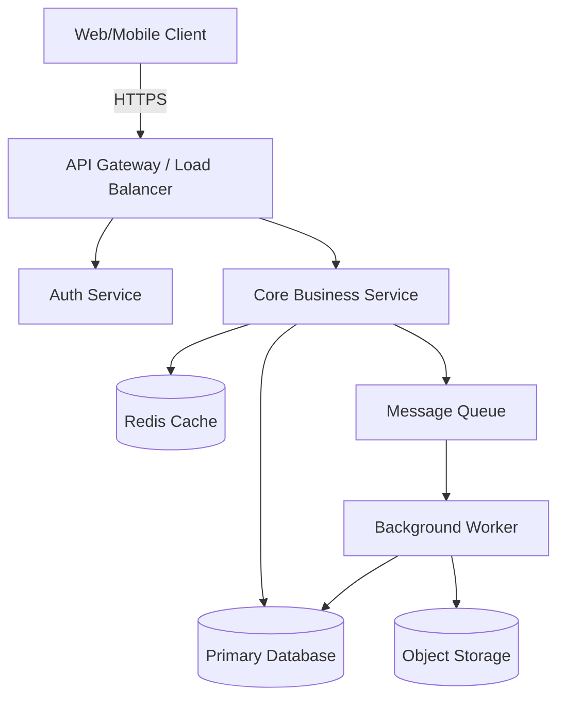

**Example 1: BRD Cost-Benefit Analysis Table**

| Category | Item | Annual Cost/Savings |
|---|---|---|
| **Cost** | Software licensing | $50,000 |
| **Cost** | Implementation | $80,000 |
| **Cost** | Training & Change Mgmt | $20,000 |
| **Savings** | Labor reallocation | $120,000 |
| **Savings** | Early-payment discounts captured | $60,000 |
| **Net** | Year 1 ROI: 210% | Payback: 8 months |

---

**Example 2: PRD User Story with Acceptance Criteria**

```
User Story: As a support agent, I want to see a customer's recent order history
when viewing their profile, so that I can resolve issues faster without switching tools.

Acceptance Criteria:
  Given I am viewing a customer profile
  When the profile loads
  Then I see the last 10 orders sorted by date (newest first)
  And each order shows: order ID, date, status, total
  And clicking an order navigates to the order detail view.

Edge Cases:
  - Customer has zero orders → show empty state with helpful message
  - API timeout → show cached data with stale indicator
```

---

**Example 3: FRD Functional Requirement**

```
FR-AUTH-01: The system shall require multi-factor authentication for admin users.

Priority: High
Source: PRD Section 4.2 (Security Requirements)

Acceptance Criteria:
  Given a user with role="admin" submits valid credentials
  When the login endpoint is called
  Then the system sends an MFA code to the registered device
  And the session is not created until the MFA code is verified
  And the MFA code expires after 5 minutes
  And after 3 failed MFA attempts, the account is locked for 15 minutes
```

---

**Example 4: SRS Non-Functional Requirement**

```
NFR-PERF-01: API Response Latency
The system shall respond to 95% of read API requests within 200ms
under a load of 1,000 concurrent users.

Measurement: p95 latency from API Gateway logs over a 5-minute window.
Threshold: Alert if p95 exceeds 300ms for 2 consecutive windows.
```

---

**Example 5: TRD Architecture Overview (Mermaid)**



---

**Example 6: Risk Assessment Matrix**

| Risk | Impact | Likelihood | Mitigation |
|---|---|---|---|
| Low user adoption | High | Medium | Phased rollout with change management |
| Integration delays | Medium | High | Early API sandbox testing with vendor |
| Data migration errors | High | Low | Dual-write validation period, rollback plan |
| Budget overrun | Medium | Medium | 15% contingency buffer, monthly reviews |

---

**Example 7: Stakeholder Analysis Table**

| Stakeholder | Role | Interest | Communication |
|---|---|---|---|
| VP Finance | Sponsor | ROI, budget adherence | Bi-weekly executive summary |
| AP Clerks | Primary User | Workflow efficiency | Weekly demos during development |
| IT Security | Secondary | Data protection, access control | Security review at design phase |
| Legal | Secondary | Regulatory compliance | Sign-off before launch |

---

**Example 8: API Specification (TRD)**

```
POST /api/v1/orders

Request:
  Headers: Authorization: Bearer <token>
  Body: {
    "customer_id": "uuid",
    "items": [{"product_id": "uuid", "quantity": 2}],
    "shipping_address": { "line1": "...", "city": "...", "zip": "..." }
  }

Success Response (201):
  { "order_id": "uuid", "status": "created", "total": 49.99, "estimated_delivery": "2025-03-15" }

Error Responses:
  400 — Invalid input (missing required fields, quantity <= 0)
  401 — Unauthorized (expired or invalid token)
  409 — Out of stock (includes unavailable item IDs)
  422 — Business rule violation (e.g., max order quantity exceeded)
```
