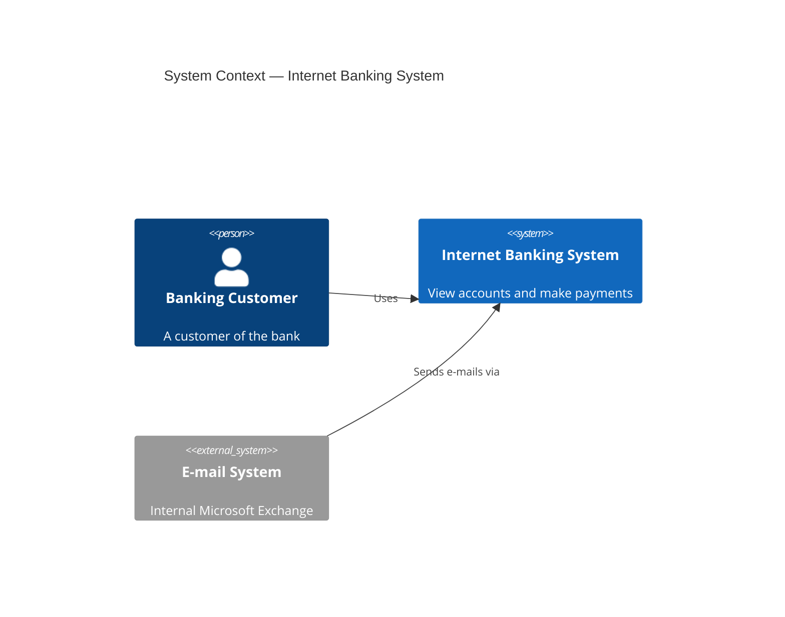
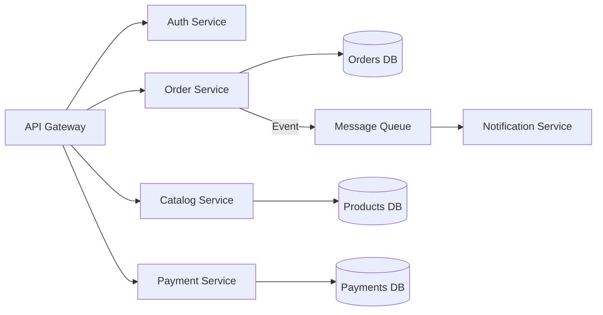

**Example 1: Refactoring to Clean Architecture (Python)**

*Before (Tight Coupling):*
```python
class UserController:
    def __init__(self):
        self.db = psycopg2.connect("...")  # Direct DB dependency

    def create_user(self, name, email):
        self.db.execute("INSERT INTO users...")  # SQL mixed with business logic
```

*After (Clean Architecture):*
```python
# Domain Layer
class UserRepository(Protocol):
    def save(self, user: User) -> None: ...

# Application Layer
class CreateUserUseCase:
    def __init__(self, repo: UserRepository):
        self.repo = repo

    def execute(self, name: str, email: str):
        user = User(name, email)
        self.repo.save(user)

# Infrastructure Layer
class PostgresUserRepository:
    def save(self, user: User):
        # DB implementation here
```

---

**Example 2: C4 Context Diagram (Mermaid)**



---

**Example 3: API Rate Limiter Design (Token Bucket)**

- **Requirement**: Limit users to 100 requests per minute.
- **Approach**: Token Bucket algorithm stored in Redis.
- **Flow**:
  1. API Gateway intercepts request.
  2. Checks Redis for user's token count.
  3. If count > 0, decrement and allow. Else, return `429 Too Many Requests`.
- **Trade-off**: Redis adds a network hop (latency), but is necessary for distributed rate limiting.

---

**Example 4: Async Report Generation Pattern**

*Anti-pattern*: Synchronous HTTP call waiting for 10-second report generation.

*Solution*:
1. Client POSTs `/api/reports`, receives `202 Accepted` with a `job_id`.
2. Server pushes job to RabbitMQ/SQS.
3. Worker processes the report and saves to S3.
4. Client polls `/api/reports/{job_id}` or receives WebSocket/Push notification when ready.

---

**Example 5: Capacity Estimation**

```python
# Given: 500 RPS, 50KB average payload
daily_requests = 500 * 86400            # 43,200,000
daily_bandwidth_mb = (daily_requests * 50) / 1024  # ~2,109,375 MB
yearly_storage_tb = (daily_bandwidth_mb * 365) / (1024 * 1024)  # ~733 TB
recommended_instances = max(1, 500 // 2000)  # 1 instance (stateless, 2k RPS each)
```

---

**Example 6: Database Scaling Decision Tree**

| Scenario | Solution |
|---|---|
| Read-heavy (10:1 ratio) | Read replicas + Cache-Aside |
| Write-heavy, small dataset | Vertical scaling + optimized writes |
| Write-heavy, large dataset | Sharding by tenant/region |
| Multi-region reads | Read replicas per region + eventual consistency |
| Ad-hoc analytics | Separate OLAP warehouse (CDC pipeline) |

---

**Example 7: Circuit Breaker Sketch (Python)**

```python
import time
from enum import Enum

class State(Enum):
    CLOSED = "closed"
    OPEN = "open"
    HALF_OPEN = "half_open"

class CircuitBreaker:
    def __init__(self, failure_threshold=5, recovery_timeout=30):
        self.failure_count = 0
        self.failure_threshold = failure_threshold
        self.recovery_timeout = recovery_timeout
        self.state = State.CLOSED
        self.last_failure_time = 0

    def call(self, func, *args):
        if self.state == State.OPEN:
            if time.time() - self.last_failure_time > self.recovery_timeout:
                self.state = State.HALF_OPEN
            else:
                raise Exception("Circuit breaker is OPEN")

        try:
            result = func(*args)
            self._on_success()
            return result
        except Exception as e:
            self._on_failure()
            raise

    def _on_success(self):
        self.failure_count = 0
        self.state = State.CLOSED

    def _on_failure(self):
        self.failure_count += 1
        self.last_failure_time = time.time()
        if self.failure_count >= self.failure_threshold:
            self.state = State.OPEN
```

---

**Example 8: Microservice Decomposition**

*Monolith → Services by Bounded Context:*


