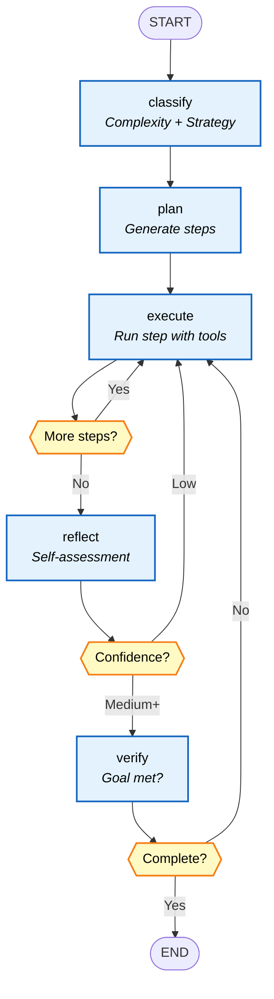
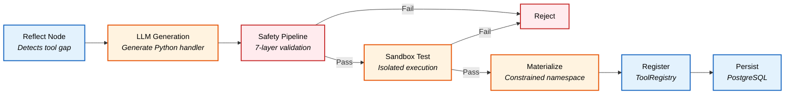
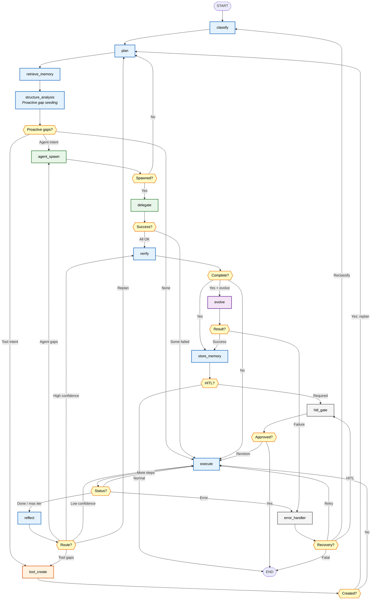
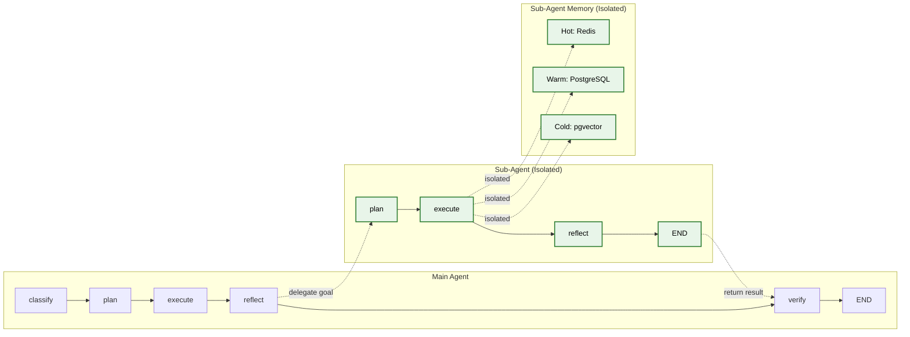
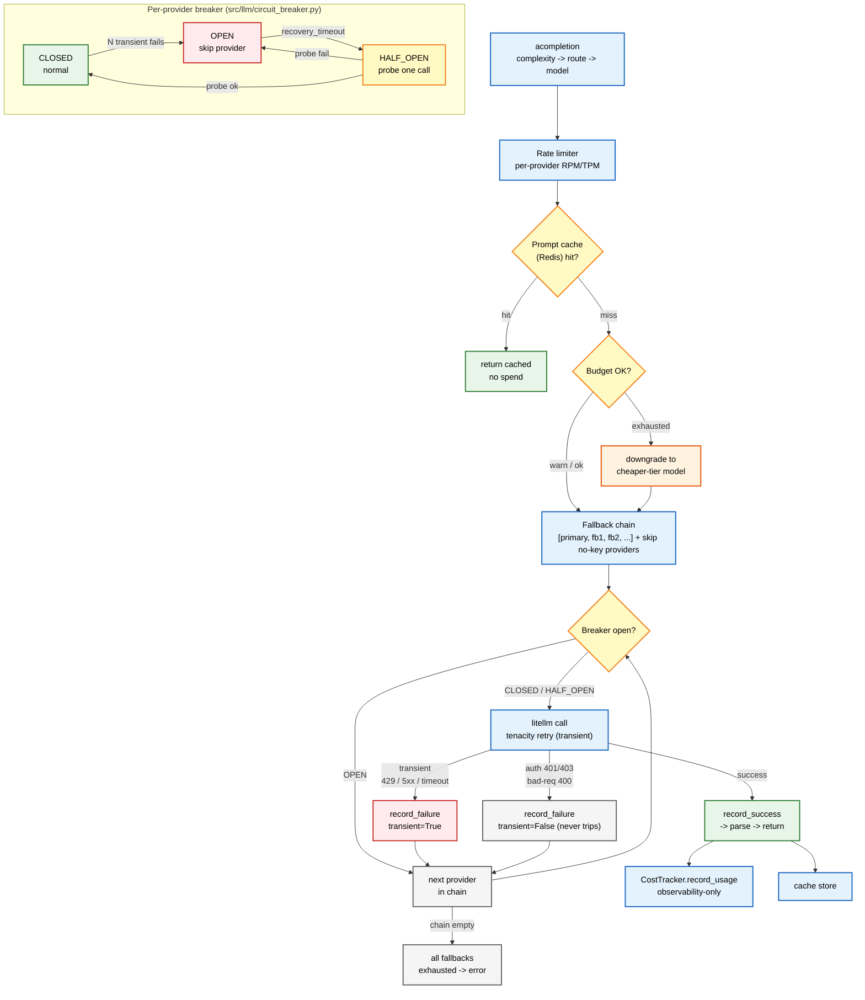
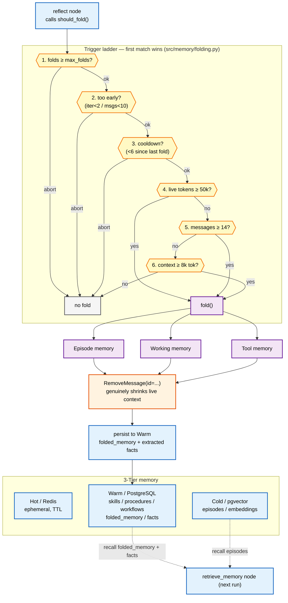

# Evolutionary Agents: Three Generations of Self-Evolving AI

> A production-grade AI agent built with **LangGraph** that progressively evolved from simple prompt refinement to a system capable of creating its own tools and spawning specialized sub-agents — all while maintaining strict safety guardrails.

---

## Table of Contents

- [Introduction](#introduction)
- [Generation 1: Simple Evolutionary Agent](#generation-1-simple-evolutionary-agent)
- [Generation 2: Tool-Creating Agent](#generation-2-tool-creating-agent)
- [Generation 3: Tool + Sub-Agent Creating Agent](#generation-3-tool--sub-agent-creating-agent-current)
- [Key Findings from Testing](#key-findings-from-testing)
- [Current Known Issues](#current-known-issues)
- [Design Decisions](#design-decisions)

---

## Introduction

This project traces the evolution of an AI agent through three distinct generations, each adding emergent capabilities:

| Generation | Evolution Scope | Tool Creation | Sub-Agent Spawning | Key Innovation |
|:---:|---|:---:|:---:|---|
| **Gen 1** | Prompt & reasoning only | No | No | Self-improving prompts via reflection |
| **Gen 2** | Prompts + tools | Yes | No | Runtime tool generation with safety |
| **Gen 3** | Prompts + tools + sub-agents | Yes | Yes | Autonomous sub-agent spawning |

All three generations share the same infrastructure stack:

- **LangGraph** for graph-based orchestration with checkpointing
- **litellm** as unified LLM gateway to 10+ providers
- **PostgreSQL + pgvector** for persistent storage and vector search
- **Redis** for ephemeral caching and rate limiting
- **pydantic-settings** for configuration management

---

## Generation 1: Simple Evolutionary Agent

The first generation was a straightforward LangGraph agent that classified tasks, planned execution steps, ran them, and reflected on results. Its only evolutionary capability was **improving its own prompts** through self-reflection and the evolution engine.

### Architecture



### Capabilities

| Feature | Implementation |
|---|---|
| Task Classification | Keyword-based complexity detection to LLM structured output |
| Planning | Strategy-templated or LLM-generated step sequences |
| Execution | LangChain `bind_tools()` with native tool calling |
| Reflection | LLM self-assessment with confidence scoring |
| Evolution | Prompt-only mutations via `SelfEvolutionEngine` |

### Limitations

The agent could only work with its fixed set of built-in tools. When it encountered tasks requiring capabilities outside those tools, it had no mechanism to bridge the gap — it would either fail or work around the limitation by overloading `code_executor`.

This limitation motivated **Generation 2**.

---

## Generation 2: Tool-Creating Agent

The second generation added a critical emergent capability: **runtime tool creation**. When the agent detects a capability gap during reflection, it generates a new Python tool via LLM, validates it through a 7-layer safety pipeline, registers it for immediate use, and persists it to PostgreSQL for future runs.

### Architecture


### Built-in Tools (14)

The agent starts with these foundational tools (7 core + 7 capability-expansion):

| Tool | Purpose |
|---|---|
| `code_executor` | Run Python code in subprocess with timeout |
| `code_validator` | AST + security validation for Python code |
| `terminal_command` | Allowlisted, shell-free terminal command tool |
| `file_reader` | Read files within sandboxed directory |
| `file_writer` | Write files with path traversal protection |
| `list_directory` | List directory entries within a sandboxed root |
| `web_search` | Web search with result parsing |
| `web_scraper` | Fetch a URL and return its main content as clean markdown |
| `http_request` | Controlled HTTP requests to external APIs/services |
| `document_parser` | Extract text from PDF/DOCX/XLSX/CSV documents |
| `environment_inspect` | Inspect the runtime environment (OS, CPU, disk, RAM, packages) |
| `get_current_time` | Current wall-clock timestamp, timezone, and date |
| `self_inspect` | Read the agent's own source code |
| `memory_search` | Query 3-tier memory (Redis, PostgreSQL, pgvector) |

### Tool Creation Pipeline

When the reflect node detects a missing capability:



### Security Model: Double-Barrier Design

Generated tools operate under strict constraints:

**Barrier 1 -- Static Analysis**: The 7-layer safety pipeline rejects any code that imports dangerous modules (`os`, `subprocess`, `sys`, `shutil`, `ctypes`, etc.), uses forbidden patterns (`eval`, `exec`, `__import__`, `os.system`), or exceeds size/complexity limits.

**Barrier 2 -- Constrained Namespace**: Even if static analysis is bypassed, the handler is materialized in a pre-built namespace that **physically lacks** dangerous modules. The namespace only contains:

| Allowed Module | Category |
|---|---|
| `httpx`, `requests` | HTTP clients |
| `json` | Serialization |
| `re` | Regular expressions |
| `math`, `statistics`, `decimal` | Computation |
| `datetime`, `dateutil` | Date/time (dateutil pip name: `python-dateutil`) |
| `pathlib` | File paths (within sandbox) |
| `collections`, `itertools` | Data structures |
| `textwrap`, `typing`, `dataclasses`, `copy` | Utilities |
| `hashlib`, `base64` | Encoding |
| `urllib.parse`, `html.parser` | URL/HTML parsing |
| `jsonschema` | JSON-Schema validation |
| `tenacity` | Retry-with-backoff primitives |
| `loguru` | Logging |

> **Browser-automation packages** (`playwright`, `selenium`, `puppeteer`,
> `playwright_stealth`) are a **deliberately deferred opt-in** — they require a
> managed browser binary and a stricter egress allowlist, so they stay blocked
> even though the read-only packages above were expanded.

**Rate Limit**: Maximum 3 tools created per run.

### Limitations

While the agent could now create tools, it still operated as a **single monolithic agent**. Complex multi-domain tasks (e.g., "analyze code quality AND generate visualizations AND write a report") had to be handled sequentially in a single execution loop, which was inefficient and sometimes exceeded iteration limits.

This motivated **Generation 3**.

---

## Generation 3: Tool + Sub-Agent Creating Agent (Current)

The current generation adds **sub-agent spawning** -- the agent can now detect when a task would benefit from parallel specialized processing, spawn sub-agents as isolated LangGraph subgraphs, delegate subtasks to them, and track their performance over time.

### Full Architecture



### Sub-Agent Spawning Pipeline

```mermaid
flowchart TD
    subgraph "Detection"
        A["Reflect Node"]:::blue --> B{"Multi-part goal?<br/>(2+ conjunctions,<br/>6+ plan steps)"}
        B -- "Yes" --> C["Add to pending_agent_gaps"]:::blue
        B -- "LLM detects gaps" --> C
    end

    subgraph "Spawn"
        C --> D["agent_spawn Node"]:::green
        D --> E["LLM generates<br/>SubAgentProposal"]:::green
        E --> F["Validate proposal<br/><i>name, scope, template</i>"]:::green
        F -- "Valid" --> G["Create SubAgentSpec"]:::green
        F -- "Invalid" --> H["Skip, log warning"]:::red
        G --> I["Persist to<br/>sub_agent_definitions"]:::blue
        I --> J["Register in<br/>SubAgentRegistry"]:::blue
    end

    subgraph "Delegate"
        J --> K["delegate Node"]:::green
        K --> L["Build isolated subgraph<br/><i>build_subgraph(spec)</i>"]:::green
        L --> M["Scope tools<br/><i>inherit_all or subset</i>"]:::green
        M --> N["Run subgraph<br/><i>plan - execute - reflect</i>"]:::green
        N --> O["Record metrics<br/><i>success, cost, latency</i>"]:::green
    end

    subgraph "Optimize"
        O --> P{"Success rate<br/>below 30% over<br/>10+ runs?"}
        P -- "Yes" --> Q["Auto-deprecate"]:::red
        P -- "No" --> R["Keep active"]:::green
    end

    classDef blue fill:#e3f2fd,stroke:#1565c0,stroke-width:2px,color:#000
    classDef green fill:#e8f5e9,stroke:#2e7d32,stroke-width:2px,color:#000
    classDef red fill:#ffebee,stroke:#c62828,stroke-width:2px,color=#000
    classDef decision fill:#fff9c4,stroke:#f57f17,stroke-width:2px,color:#000
    class B,P decision
```

### Parallel Sub-Agent Delegation

The delegate node executes sub-agents in parallel using `asyncio.gather()`:

```python
async def delegate_node(state: AgentState) -> dict:
    """Delegate subtasks to spawned sub-agents in parallel."""
    
    pending_gaps = state.get("pending_agent_gaps", [])
    
    # Build delegation tasks for each gap
    delegate_tasks = []
    for gap in pending_gaps:
        spec = sub_agent_registry.get(gap.sub_agent_name)
        if spec:
            task = _delegate_to_sub_agent(spec, gap.subtask, state)
            delegate_tasks.append(task)
    
    # Execute in parallel with concurrency limit
    MAX_CONCURRENT_SUB_AGENTS = 3
    semaphore = asyncio.Semaphore(MAX_CONCURRENT_SUB_AGENTS)
    
    async def execute_with_limit(task):
        async with semaphore:
            return await task
    
    results = await asyncio.gather(
        *[execute_with_limit(t) for t in delegate_tasks],
        return_exceptions=True
    )
    
    # Process results and update metrics
    delegation_results = []
    for i, result in enumerate(results):
        if isinstance(result, Exception):
            # Handle failure, update metrics
            sub_agent_registry.record_failure(
                pending_gaps[i].sub_agent_name
            )
        else:
            # Record success metrics
            sub_agent_registry.record_success(
                pending_gaps[i].sub_agent_name,
                cost=result.cost,
                latency=result.latency
            )
            delegation_results.append(result)
    
    return {"delegation_results": delegation_results}
```

**Three-Phase Parallel Delegation:**

1. **Spawn Phase** — Create sub-agent specifications via LLM, validate, persist to DB
2. **Execute Phase** — Run all sub-agent subgraphs in parallel via `run_parallel()`
3. **Post-Process Phase** — Aggregate results, update rolling metrics, handle failures

**Concurrency Constraints:**
- `MAX_CONCURRENT_SUB_AGENTS = 3` — Maximum parallel sub-agent executions
- `MAX_CONCURRENT_TOOLS = 5` — Maximum parallel tool executions per sub-agent
- Rate limiters prevent resource exhaustion

### Sub-Agent Design

Each sub-agent runs as an **isolated LangGraph subgraph** with its own state:



**Key constraints (intentional design decisions):**

| Constraint | Value | Rationale |
|---|---|---|
| Max sub-agents per run | 3 | Prevents runaway spawning |
| Sub-agents do NOT self-evolve | -- | Main agent evolves on their behalf |
| Sub-agents inherit parent tools | -- | No independent tool creation |
| Each sub-agent has isolated memory | -- | Prevents cross-contamination |
| Rolling metrics window | Last 100 runs | Statistical significance for deprecation |
| Auto-deprecation threshold | Success rate < 30% | Removes persistently failing agents |

### Persistence Across Runs

Tools and sub-agents created during one run are loaded at startup in subsequent runs:

1. **`main.py` -- `_load_dynamic_tools()`**: Loads active tools from `tool_registrations` + `tool_versions` tables
2. **`main.py` -- `_load_sub_agents()`**: Loads active agents from `sub_agent_definitions` table
3. Both run before graph execution, making previously created capabilities immediately available

---

## Key Findings from Testing

Extensive end-to-end testing across multiple query types revealed these key observations:

### 1. Sub-Agent Spawning Works End-to-End

The complete pipeline operates correctly: heuristic detection (2+ conjunctions + 6+ plan steps) to `agent_spawn` node to LLM proposal to validation to persist to DB to `delegate` to subgraph execution to metrics recording. All sub-agents were created, persisted, and loaded correctly across runs.

### 2. Dynamic Tool Creation Is Never Triggered Organically

The `code_executor` built-in tool is powerful enough to handle virtually any computational task by running arbitrary Python code. Since the execute node always has `code_executor` available, the LLM never generates "Unknown tool" errors. And since tasks complete successfully, the reflect node never identifies missing tool capabilities. The tool creation pipeline (`tool_create_node` to `ToolGenerator` to safety pipeline to registry) is implemented correctly but cannot be exercised organically -- this is a **design limitation**, not a bug.

### 3. Memory Persistence Works

Observations and lessons from each run are stored in warm + cold memory tiers and retrieved in subsequent runs, providing meaningful cross-run context. Runs correctly retrieved 5 memories from prior executions.

### 4. Graph Cycles Correctly

The graph correctly handles multiple `plan -> execute -> reflect -> spawn -> delegate` cycles within a single invocation. The `Annotated[list, operator.add]` reducer accumulates state across cycles, and conditional edges route correctly through all 13 nodes.

### 5. Sub-Agent Delegation Is Reliable

All delegation attempts succeeded (9/9 in Q1, 1/1 in Q2, 1/1 in Q3). Sub-agents run isolated subgraphs with their own `plan -> execute -> reflect` cycles and return results to the parent's verify node.

---

## Current Known Issues

| Issue | Severity | Status | Details |
|:---|:---:|:---:|---|
| ~~No dynamic tools created organically~~ | Medium | Resolved | `code_executor` was a catch-all. Fixed by: narrowing tool description, adding tool efficiency evaluation to reflect prompt, and heuristic overuse detection (3+ code_executor calls triggers a tool gap). |
| ~~`pending_agent_gaps` accumulates without dedup~~ | Medium | Resolved | Gaps are now deduplicated against existing state before returning from reflect. Router skips agent_spawn when sub-agents already spawned. |
| ~~Workspace files not written~~ | Low | Resolved | Execute prompt now includes tool selection guidelines encouraging file_writer for persistent output. code_executor description narrowed to discourage file I/O usage. |
| ~~Max sub-agents limit discards remaining gaps~~ | Medium | Resolved | When MAX_SUB_AGENTS_PER_RUN is reached, remaining agent gaps are now converted to tool creation opportunities instead of being silently deferred. |
| Sub-agent tool quality untested | Medium | Open | Sub-agents can now create tools at runtime, but the quality and safety of tools created within sub-agent subgraphs has not been extensively tested end-to-end. |
| Run history requires workspace directory | Low | Open | RunHistoryGenerator creates the workspace directory on first use. If the parent path is not writable, history generation is silently skipped. |
| Max 3 sub-agents limit works correctly | Info | -- | The rate limit fires properly: "Max sub-agents per run (3) reached, remaining gaps converted to tool gaps". |
| Memory retrieval works cross-run | Info | -- | Q2 and Q3 both retrieved 5 memories from prior runs, using them for context. |

---

## Design Decisions

### Why Sub-Agents Do NOT Self-Evolve

Sub-agents are deliberately excluded from the evolution engine. If sub-agents could mutate independently, the system would face:
- **Exponential complexity**: N sub-agents x M mutation types = NxM parallel evolution tracks
- **Coordination failures**: Mutated sub-agents might develop incompatible interfaces
- **Debugging difficulty**: Root-causing failures across independently evolved agents is extremely hard

Instead, the **main agent evolves on behalf of its sub-agents**. When the evolution engine identifies improvements, it can mutate sub-agent prompts, tool scopes, and model tiers through the main agent's `SubAgentMutation` type.

### Why Sub-Agents Can Now Create Their Own Tools

Sub-agents were initially restricted from creating tools (inheriting only from the parent). This was changed because:
- **Capability gaps in sub-agents**: Sub-agents handling specialized domains sometimes need tools that the parent does not have (e.g., a data visualization sub-agent needing a chart rendering tool)
- **Safety is maintained**: All tool creation goes through the same 7-layer safety pipeline with the same 14-module allowlist
- **The sub-agent subgraph includes tool_create**: The fixed template always includes the `tool_create` node and `_route_after_reflect_sub` router, which routes to tool creation when gaps are detected

Sub-agents with `tool_scope="inherit_all"` inherit all parent tools AND can create new ones. This gives them both immediate capability and the ability to extend themselves.

### Why Each Sub-Agent Has Isolated Memory

Shared memory between sub-agents creates:
- **Cross-contamination**: One sub-agent's episodic memory could bias another's reasoning
- **Race conditions**: Concurrent sub-agents writing to the same memory keys
- **Attribution ambiguity**: Which sub-agent generated which memory?

Isolated memory ensures clean attribution and prevents sub-agents from interfering with each other's learning.

### Why Max 3 Tools / 3 Sub-Agents Per Run

These limits prevent runaway resource consumption:
- Each tool creation requires an LLM call + safety validation + sandbox execution
- Each sub-agent spawns its own subgraph with multiple LLM calls
- In testing, 3 was sufficient for complex multi-domain tasks
- The limits can be configured via `settings.agent.max_sub_agents`

---

## Recent Improvements

### Jinja2 Prompt Template System

All prompt templates have been externalized from `src/graph/prompts.py` into a jinja2-based template package at `src/graph/prompts/templates/`. The `PromptTemplate` wrapper class provides a `.format()` method that delegates to `jinja2.Template.render()`, maintaining full backward compatibility with all node imports. This enables:

- **Easier prompt tuning** without modifying Python code
- **Prompt versioning** via git history on `.j2` files
- **Template composition** using jinja2 features (``, ``, etc.)
- **Future prompt registry** for A/B testing and evolution

### Gap Deduplication

Both `pending_tool_gaps` and `pending_agent_gaps` now deduplicate against existing state before returning from the reflect node. The router also guards against routing to `agent_spawn` when sub-agents have already been spawned for the current gaps.

### Tool Efficiency Evaluation

The reflect prompt now includes a 7th evaluation criterion: tool efficiency. When the agent uses `code_executor` for recurring patterns (3+ times), the heuristic reflector identifies this as a tool gap and suggests creating a dedicated tool. The `code_executor` tool description has been narrowed to discourage usage for file I/O and recurring tasks.

### Max Sub-Agents Fallback

When `MAX_SUB_AGENTS_PER_RUN` (3) is reached, remaining agent gaps are converted to tool creation opportunities rather than being silently deferred. The `route_after_agent_spawn` router now supports routing to `tool_create` when converted tool gaps exist, and the task graph has a new edge from `agent_spawn` to `tool_create`.

### Run History Generation

After each agent execution, a markdown run history file is generated at `.turing/workspace/run_history_YYYYMMDD_HHMMSS.md`. The file includes:

- Timestamp, thread ID, goal text
- Classification (strategy, confidence)
- Plan steps with completion status
- Tool usage breakdown and new tools created
- Sub-agents spawned and delegation results
- Metrics (iterations, tokens, cost)
- Errors and final output

### Capability Governance (Semantic Dedup + Caps + Retirement)

Stored tools and sub-agents are curated at load time so the ecosystem does not
bloat across runs (gated behind the `settings` passed into the loaders):

- **Semantic dedup** — a newly proposed tool/sub-agent is embedded and compared
  against existing active capabilities; a near-duplicate (`find_similar`) is
  rejected rather than re-created.
- **Cumulative caps** — active counts are enforced against
  `max_active_tools` (25) and `max_active_sub_agents` (60); the lowest-scoring
  excess is retired (`enforce_caps` / `_retire_excess_tools`).
- **Redundancy retirement** — capabilities superseded by a better-scoring peer
  are retired (`retire_redundant`), preserving history while trimming the active set.

### Provider Circuit Breaker

The LLM gateway wraps provider calls in a per-provider circuit breaker
(CLOSED → OPEN → HALF_OPEN). After consecutive **transient** failures
(rate-limit / 5xx / timeout) it OPENs, and `_execute_with_fallback` skips the
open provider to the next entry in its fallback chain, then a HALF_OPEN probe
tests recovery. **Authentication (401/403) and bad-request (400) errors never
trip the breaker** (per the error-handling rule — only transient errors retry).
State transitions are exported via a Prometheus counter
(`circuit_breaker_state_transitions_total`).



### Prompting-Technique Selection Layer

A selector maps `TaskComplexity` × node × inferred goal-pattern to the right
prompting technique(s) — few-shot for simple, chain-of-thought /
least-to-most for complex, chain-of-verification / self-consistency /
checklist for verify-critical — and splices them into the plan, execute,
reflect, and verify prompts. The helper `select_techniques_for_node()`
returns `[]` on a `None` complexity (the heuristic-fallback path applies no
techniques). Techniques render from versioned Jinja2 templates under
`src/graph/prompts/techniques/`.

### Cost-Ledger Resilience

Cost tracking (`CostTracker.record_usage`) is **observability-only**: the
`add` + `commit` is wrapped so a failed ledger write rolls back its own
transaction, is logged at WARNING, and **never re-raises** — a transient DB
problem in the ledger can never abort an otherwise-successful run. A poisoned
session recovers on the next call.

### Verify Grounding

Before a run is marked complete, the verify node spot-checks that result paths
it cites actually exist on disk (`_spot_check_cited_paths`), catching
hallucinated deliverable paths.

### Autonomous Memory Folding

The reflect node compresses a long live conversation into three structured
summaries — episode (key events/decisions), working (current goals/next
actions), tool (usage patterns/rules) — via LangGraph `RemoveMessage`, which
genuinely shrinks context. Summaries persist to warm memory
(`memory_type="folded_memory"`) and are recalled on later runs. A trigger
ladder (cap → min-guard → cooldown → live-token → message-count →
context-size) bounds folding to `MEMORY_FOLDING_MAX_FOLDS` per run.



### Final-Answer Streaming

`python main.py --stream` streams the final answer token-by-token to stdout
over a fresh gateway (non-streaming runs are unchanged). The stream handler
absorbs `asyncio.CancelledError` and falls back to the static `final_output`
if the stream is empty.

### Battery-04 Production Hardening

The production-robustness pass (see [`docs/validation-battery-04.md`](validation-battery-04.md))
added a correctness + robustness layer over the existing process metrics:

- **Typed correctness eval harness** (`src/eval/{checks,golden,store}.py`) — Structural
  (schema/keys/row-count/required-fields), Execution (sandbox probe asserting invariants such as
  UTC conformance / no-null-required), Golden (exact/regex/numeric-tolerance vs a golden spec), and
  Oracle (LLM-judge via lazy `deepeval`/`ragas`) checks. Wired into the verify node behind
  `EVAL_ENABLED`; results persist to the `eval_results` table; `main.py --eval` runs the golden suite.
  Battery-04 live result: **q1 9/9, q2 13/14 checks pass**. *(Known gap F-e: checks fire only at
  `is_complete=True`, so a never-converging run is not eval-rescued.)*
- **Verify completion discipline** — the verify node refuses to force-complete unless the goal's
  *expected* deliverable is present, non-empty, and well-formed: `.md`/`.txt` are placeholder-leak-scanned,
  `.csv`/`.json`/`.jsonl` are parse-checked, and goal-deliverable extraction skips input-context paths and
  requires ≥2-char extensions. A missing deliverable triggers a re-plan, never a false success.
- **Per-tool metrics + performance retirement** — `src/tools/metrics.py` records each invocation's
  success/empty/latency to the `tool_call_metrics` table; governance retires tools below a success-rate
  floor once they have enough runs (alongside semantic-dedup/cap/redundancy retirement).
- **Semantic/fact memory tier** (`src/memory/facts.py`) — durable `memory_type="fact"` rows, extracted
  during folding and recalled alongside skills/episodes (de-conflating durable facts from episodic memory).
- **Cross-process `--resume`** — a killed/interrupted run resumes from its last `AsyncPostgresSaver`
  checkpoint (`thread_id = f"cli-{run_id}"`) via `main.py --resume <run-id>`.
- **Per-run results subfolders** — writes organize under `results/<run-id>/` (reads fall back to the flat
  root for backward recall); `--results-dir` / `--clean` CLI flags.
- **Evolution→live promotion gate** (`src/evolution/promote.py`) — a PROMPT mutation that passes
  post-deploy verify promotes to a versioned, canary-gated pointer (auto-rollback on regression); opt-in
  via `EVOLUTION_PROMOTE_TO_LIVE`.
- **Centralized config** — every resilience/circuit-breaker/rate-limiter/tool-limit/concurrency value is a
  `pydantic-settings` env var (no hardcoded timeouts/caps in source).

---

## Technology Stack

| Component | Technology | Purpose |
|---|---|---|
| Orchestration | LangGraph | StateGraph with checkpointing |
| LLM Gateway | litellm | Unified API to 10+ providers |
| Database | PostgreSQL + pgvector | Persistent storage + vector search |
| Cache | Redis | Ephemeral memory + rate limiting |
| Configuration | pydantic-settings | `.env`-driven settings |
| Embeddings | litellm + hash fallback | Vector embeddings for memory |
| Observability | LangSmith + Prometheus + OTel | Tracing, metrics, logging |
| Safety | Custom 7-layer pipeline | Code validation + sandboxing |
| Testing | pytest + pytest-asyncio | 3-layer test strategy |

---

## License

This project is licensed under the **PolyForm Noncommercial License 1.0.0**. Non-commercial use is permitted. Commercial use requires explicit written permission.
