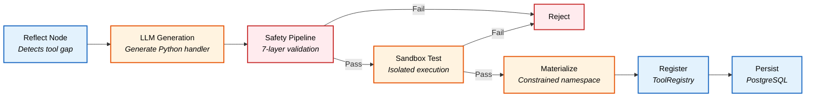
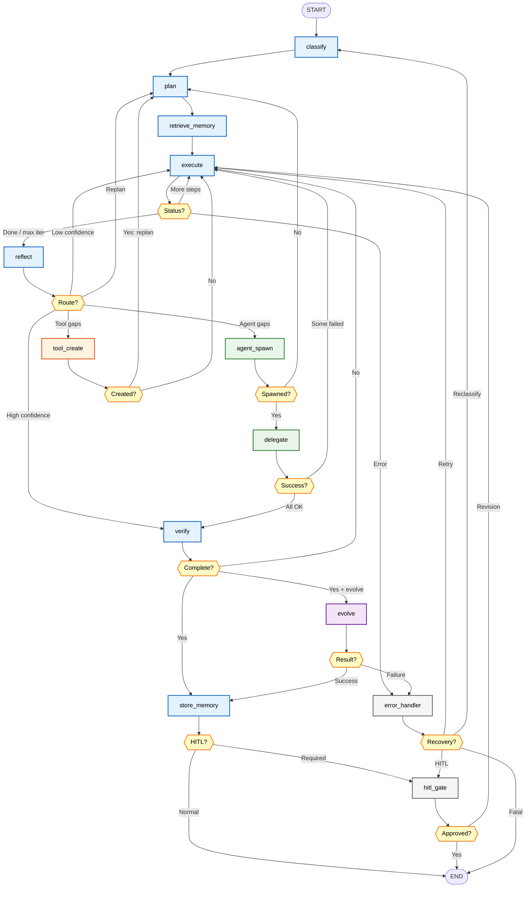
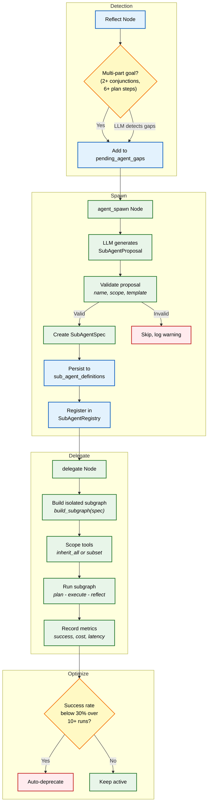
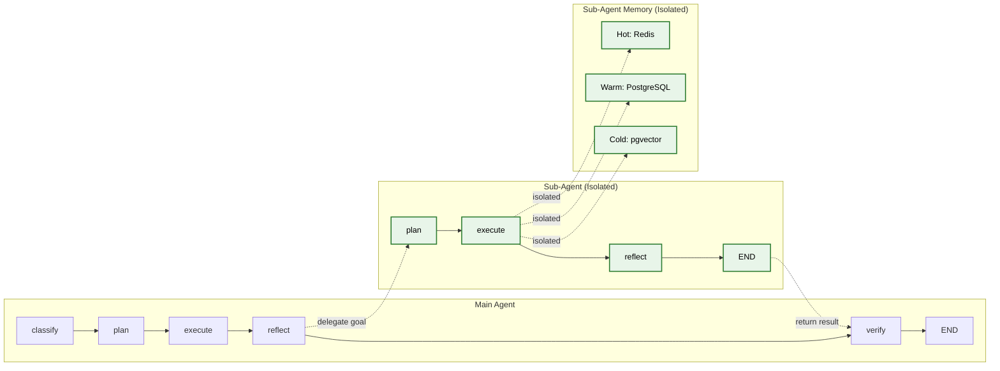

# Evolutionary Agents: Three Generations of Self-Evolving AI

> A production-grade AI agent built with **LangGraph** that progressively evolved from simple prompt refinement to a system capable of creating its own tools and spawning specialized sub-agents — all while maintaining strict safety guardrails.

---

## Table of Contents

- [Introduction](#introduction)
- [Generation 1: Simple Evolutionary Agent](#generation-1-simple-evolutionary-agent)
- [Generation 2: Tool-Creating Agent](#generation-2-tool-creating-agent)
- [Generation 3: Tool + Sub-Agent Creating Agent](#generation-3-tool--sub-agent-creating-agent-current)
- [Key Findings from Testing](#key-findings-from-testing)
- [Current Known Issues](#current-known-issues)
- [Design Decisions](#design-decisions)

---

## Introduction

This project traces the evolution of an AI agent through three distinct generations, each adding emergent capabilities:

| Generation | Evolution Scope | Tool Creation | Sub-Agent Spawning | Key Innovation |
|:---:|---|:---:|:---:|---|
| **Gen 1** | Prompt & reasoning only | No | No | Self-improving prompts via reflection |
| **Gen 2** | Prompts + tools | Yes | No | Runtime tool generation with safety |
| **Gen 3** | Prompts + tools + sub-agents | Yes | Yes | Autonomous sub-agent spawning |

All three generations share the same infrastructure stack:

- **LangGraph** for graph-based orchestration with checkpointing
- **litellm** as unified LLM gateway to 10+ providers
- **PostgreSQL + pgvector** for persistent storage and vector search
- **Redis** for ephemeral caching and rate limiting
- **pydantic-settings** for configuration management

---

## Generation 1: Simple Evolutionary Agent

The first generation was a straightforward LangGraph agent that classified tasks, planned execution steps, ran them, and reflected on results. Its only evolutionary capability was **improving its own prompts** through self-reflection and the evolution engine.

### Architecture

### Capabilities

| Feature | Implementation |
|---|---|
| Task Classification | Keyword-based complexity detection to LLM structured output |
| Planning | Strategy-templated or LLM-generated step sequences |
| Execution | LangChain `bind_tools()` with native tool calling |
| Reflection | LLM self-assessment with confidence scoring |
| Evolution | Prompt-only mutations via `SelfEvolutionEngine` |

### Limitations

The agent could only work with its fixed set of built-in tools. When it encountered tasks requiring capabilities outside those tools, it had no mechanism to bridge the gap — it would either fail or work around the limitation by overloading `code_executor`.

This limitation motivated **Generation 2**.

---

## Generation 2: Tool-Creating Agent

The second generation added a critical emergent capability: **runtime tool creation**. When the agent detects a capability gap during reflection, it generates a new Python tool via LLM, validates it through a 7-layer safety pipeline, registers it for immediate use, and persists it to PostgreSQL for future runs.

### Architecture

### Built-in Tools (7)

The agent starts with these foundational tools:

| Tool | Purpose |
|---|---|
| `code_executor` | Run Python code in subprocess with timeout |
| `code_validator` | AST + security validation for Python code |
| `web_search` | DuckDuckGo HTML search with result parsing |
| `file_reader` | Read files within sandboxed directory |
| `file_writer` | Write files with path traversal protection |
| `self_inspect` | Read the agent's own source code |
| `memory_search` | Query 3-tier memory (Redis, PostgreSQL, pgvector) |

### Tool Creation Pipeline

When the reflect node detects a missing capability:

### Security Model: Double-Barrier Design

Generated tools operate under strict constraints:

**Barrier 1 -- Static Analysis**: The 7-layer safety pipeline rejects any code that imports dangerous modules (`os`, `subprocess`, `sys`, `shutil`, `ctypes`, etc.), uses forbidden patterns (`eval`, `exec`, `__import__`, `os.system`), or exceeds size/complexity limits.

**Barrier 2 -- Constrained Namespace**: Even if static analysis is bypassed, the handler is materialized in a pre-built namespace that **physically lacks** dangerous modules. The namespace only contains:

| Allowed Module | Category |
|---|---|
| `httpx` | HTTP client |
| `json` | Serialization |
| `re` | Regular expressions |
| `math`, `statistics`, `decimal` | Computation |
| `datetime` | Date/time |
| `pathlib` | File paths (within sandbox) |
| `collections`, `itertools` | Data structures |
| `textwrap`, `typing`, `dataclasses`, `copy` | Utilities |
| `hashlib`, `base64` | Encoding |
| `urllib.parse`, `html.parser` | URL/HTML parsing |
| `loguru` | Logging |

**Rate Limit**: Maximum 3 tools created per run.

### Limitations

While the agent could now create tools, it still operated as a **single monolithic agent**. Complex multi-domain tasks (e.g., "analyze code quality AND generate visualizations AND write a report") had to be handled sequentially in a single execution loop, which was inefficient and sometimes exceeded iteration limits.

This motivated **Generation 3**.

---

## Generation 3: Tool + Sub-Agent Creating Agent (Current)

The current generation adds **sub-agent spawning** -- the agent can now detect when a task would benefit from parallel specialized processing, spawn sub-agents as isolated LangGraph subgraphs, delegate subtasks to them, and track their performance over time.

### Full Architecture

### Sub-Agent Spawning Pipeline

### Sub-Agent Design

Each sub-agent runs as an **isolated LangGraph subgraph** with its own state:

**Key constraints (intentional design decisions):**

| Constraint | Value | Rationale |
|---|---|---|
| Max sub-agents per run | 3 | Prevents runaway spawning |
| Sub-agents do NOT self-evolve | -- | Main agent evolves on their behalf |
| Sub-agents inherit parent tools | -- | No independent tool creation |
| Each sub-agent has isolated memory | -- | Prevents cross-contamination |
| Rolling metrics window | Last 100 runs | Statistical significance for deprecation |
| Auto-deprecation threshold | Success rate < 30% | Removes persistently failing agents |

### Persistence Across Runs

Tools and sub-agents created during one run are loaded at startup in subsequent runs:

1. **`main.py` -- `_load_dynamic_tools()`**: Loads active tools from `tool_registrations` + `tool_versions` tables
2. **`main.py` -- `_load_sub_agents()`**: Loads active agents from `sub_agent_definitions` table
3. Both run before graph execution, making previously created capabilities immediately available

---

## Key Findings from Testing

Extensive end-to-end testing across multiple query types revealed these key observations:

### 1. Sub-Agent Spawning Works End-to-End

The complete pipeline operates correctly: heuristic detection (2+ conjunctions + 6+ plan steps) to `agent_spawn` node to LLM proposal to validation to persist to DB to `delegate` to subgraph execution to metrics recording. All sub-agents were created, persisted, and loaded correctly across runs.

### 2. Dynamic Tool Creation Is Never Triggered Organically

The `code_executor` built-in tool is powerful enough to handle virtually any computational task by running arbitrary Python code. Since the execute node always has `code_executor` available, the LLM never generates "Unknown tool" errors. And since tasks complete successfully, the reflect node never identifies missing tool capabilities. The tool creation pipeline (`tool_create_node` to `ToolGenerator` to safety pipeline to registry) is implemented correctly but cannot be exercised organically -- this is a **design limitation**, not a bug.

### 3. Memory Persistence Works

Observations and lessons from each run are stored in warm + cold memory tiers and retrieved in subsequent runs, providing meaningful cross-run context. Runs correctly retrieved 5 memories from prior executions.

### 4. Graph Cycles Correctly

The graph correctly handles multiple `plan -> execute -> reflect -> spawn -> delegate` cycles within a single invocation. The `Annotated[list, operator.add]` reducer accumulates state across cycles, and conditional edges route correctly through all 13 nodes.

### 5. Sub-Agent Delegation Is Reliable

All delegation attempts succeeded (9/9 in Q1, 1/1 in Q2, 1/1 in Q3). Sub-agents run isolated subgraphs with their own `plan -> execute -> reflect` cycles and return results to the parent's verify node.

---

## Current Known Issues

| Issue | Severity | Details |
|:---|:---:|---|
| No dynamic tools created organically | Medium | `code_executor` is a catch-all -- the LLM uses it for everything, so the reflect node never identifies tool gaps. The `missing_tools` field is always empty. This is a design limitation, not a bug. Consider restricting `code_executor` scope or adding explicit gap analysis. |
| `pending_agent_gaps` accumulates without dedup | Medium | The `Annotated[list, operator.add]` reducer accumulates gaps across cycles. The list can grow to 24+ items with many duplicates. The `sub_agents_spawned` check prevents re-spawning, but the router still routes to `agent_spawn` with stale gaps, consuming iterations. |
| Workspace files not written | Low | No files written to `.turing/workspace/` -- the agent uses `code_executor` for in-process work rather than `file_writer`. The `file_writer` tool exists but is rarely selected by the LLM. |
| Max 3 sub-agents limit works correctly | Info | The rate limit fires properly: "Max sub-agents per run (3) reached, remaining gaps deferred". |
| Memory retrieval works cross-run | Info | Q2 and Q3 both retrieved 5 memories from prior runs, using them for context. |

---

## Design Decisions

### Why Sub-Agents Do NOT Self-Evolve

Sub-agents are deliberately excluded from the evolution engine. If sub-agents could mutate independently, the system would face:
- **Exponential complexity**: N sub-agents x M mutation types = NxM parallel evolution tracks
- **Coordination failures**: Mutated sub-agents might develop incompatible interfaces
- **Debugging difficulty**: Root-causing failures across independently evolved agents is extremely hard

Instead, the **main agent evolves on behalf of its sub-agents**. When the evolution engine identifies improvements, it can mutate sub-agent prompts, tool scopes, and model tiers through the main agent's `SubAgentMutation` type.

### Why Sub-Agents Inherit Tools But Cannot Create Their Own

Allowing sub-agents to create their own tools would create:
- **Redundant tool creation**: Multiple sub-agents might independently create the same tool
- **Safety surface expansion**: Each tool creation point multiplies the attack surface for code injection
- **Coordination overhead**: Tools created by one sub-agent might conflict with those of another

By inheriting the parent's tool registry (including dynamically created tools), sub-agents get full capability without the complexity.

### Why Each Sub-Agent Has Isolated Memory

Shared memory between sub-agents creates:
- **Cross-contamination**: One sub-agent's episodic memory could bias another's reasoning
- **Race conditions**: Concurrent sub-agents writing to the same memory keys
- **Attribution ambiguity**: Which sub-agent generated which memory?

Isolated memory ensures clean attribution and prevents sub-agents from interfering with each other's learning.

### Why Max 3 Tools / 3 Sub-Agents Per Run

These limits prevent runaway resource consumption:
- Each tool creation requires an LLM call + safety validation + sandbox execution
- Each sub-agent spawns its own subgraph with multiple LLM calls
- In testing, 3 was sufficient for complex multi-domain tasks
- The limits can be configured via `settings.agent.max_sub_agents`

---

## Technology Stack

| Component | Technology | Purpose |
|---|---|---|
| Orchestration | LangGraph | StateGraph with checkpointing |
| LLM Gateway | litellm | Unified API to 10+ providers |
| Database | PostgreSQL + pgvector | Persistent storage + vector search |
| Cache | Redis | Ephemeral memory + rate limiting |
| Configuration | pydantic-settings | `.env`-driven settings |
| Embeddings | litellm + hash fallback | Vector embeddings for memory |
| Observability | LangSmith + Prometheus + OTel | Tracing, metrics, logging |
| Safety | Custom 7-layer pipeline | Code validation + sandboxing |
| Testing | pytest + pytest-asyncio | 3-layer test strategy |

---

## License

This project is licensed under the **PolyForm Noncommercial License 1.0.0**. Non-commercial use is permitted. Commercial use requires explicit written permission.
