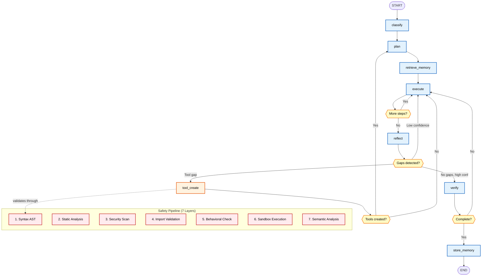
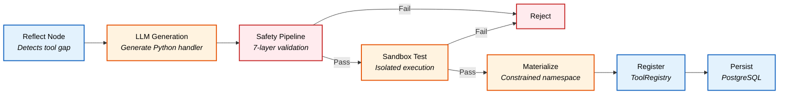
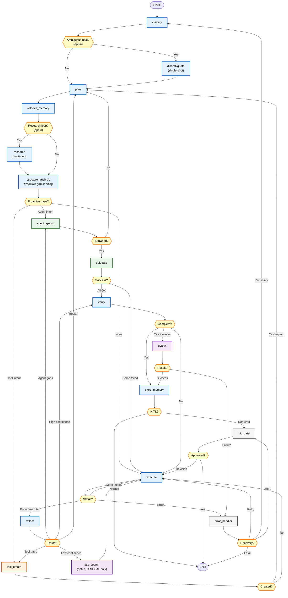
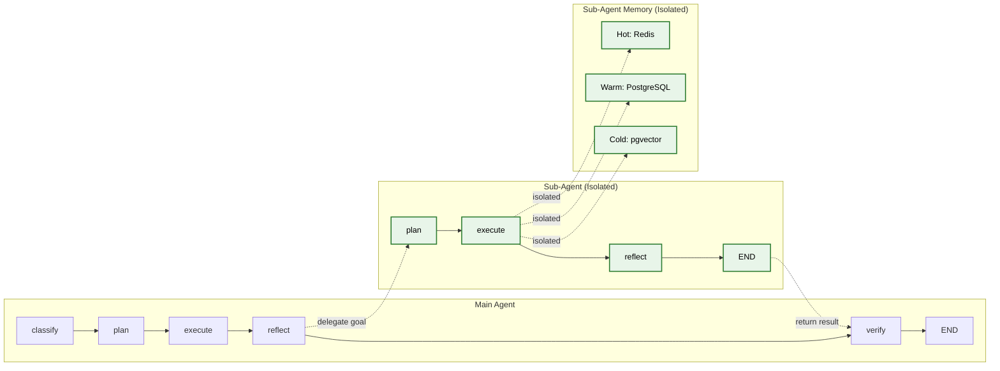
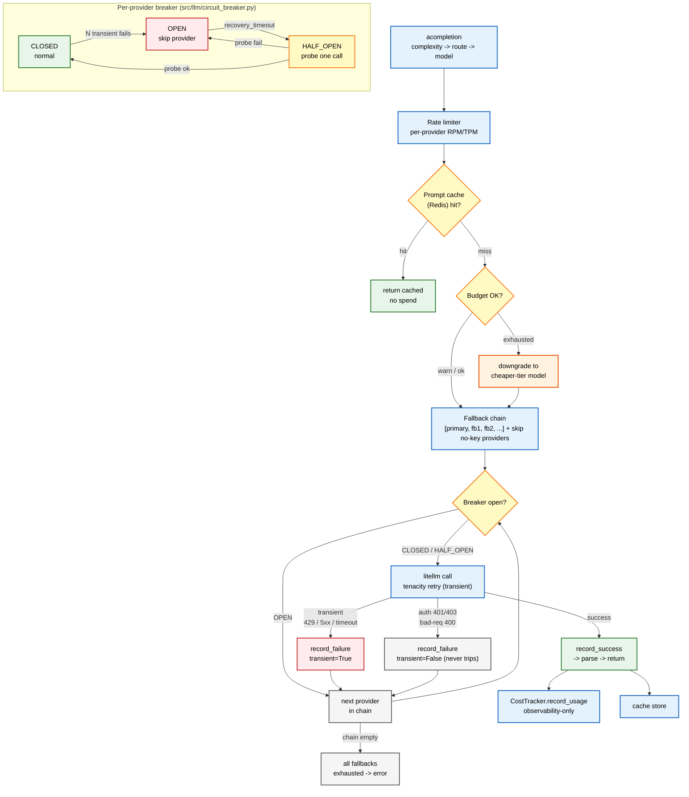
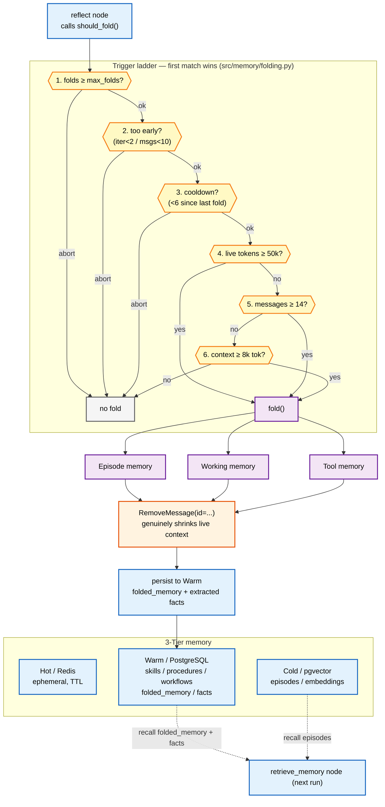

# Evolutionary Agents: Three Generations of Self-Evolving AI

> A production-grade AI agent built with **LangGraph** that progressively evolved from simple prompt refinement to a system capable of creating its own tools and spawning specialized sub-agents — all while maintaining strict safety guardrails.

---

## Table of Contents

- [Introduction](#introduction)
- [Generation 1: Simple Evolutionary Agent](#generation-1-simple-evolutionary-agent)
- [Generation 2: Tool-Creating Agent](#generation-2-tool-creating-agent)
- [Generation 3: Tool + Sub-Agent Creating Agent](#generation-3-tool--sub-agent-creating-agent-current)
- [Key Findings from Testing](#key-findings-from-testing)
- [Current Known Issues](#current-known-issues)
- [Design Decisions](#design-decisions)

---

## Introduction

This project traces the evolution of an AI agent through three distinct generations, each adding emergent capabilities:

| Generation | Evolution Scope | Tool Creation | Sub-Agent Spawning | Key Innovation |
|:---:|---|:---:|:---:|---|
| **Gen 1** | Prompt & reasoning only | No | No | Self-improving prompts via reflection |
| **Gen 2** | Prompts + tools | Yes | No | Runtime tool generation with safety |
| **Gen 3** | Prompts + tools + sub-agents | Yes | Yes | Autonomous sub-agent spawning |

All three generations share the same infrastructure stack:

- **LangGraph** for graph-based orchestration with checkpointing
- **litellm** as unified LLM gateway to 10+ providers
- **PostgreSQL + pgvector** for persistent storage and vector search
- **Redis** for ephemeral caching and rate limiting
- **pydantic-settings** for configuration management

---

## Generation 1: Simple Evolutionary Agent

The first generation was a straightforward LangGraph agent that classified tasks, planned execution steps, ran them, and reflected on results. Its only evolutionary capability was **improving its own prompts** through self-reflection and the evolution engine.

### Architecture


### Capabilities

| Feature | Implementation |
|---|---|
| Task Classification | Keyword-based complexity detection → LLM structured output |
| Planning | Strategy-templated or LLM-generated step sequences |
| Execution | litellm native tool-calling via `LLMGateway.acompletion_with_tools` |
| Reflection | LLM self-assessment with confidence scoring |
| Evolution | Prompt-only mutations via `SelfEvolutionEngine` |

### Limitations

The agent could only work with its fixed set of built-in tools. When it encountered tasks requiring capabilities outside those tools, it had no mechanism to bridge the gap — it would either fail or work around the limitation by overloading `code_executor`.

This limitation motivated **Generation 2**.

---

## Generation 2: Tool-Creating Agent

The second generation added a critical emergent capability: **runtime tool creation**. When the agent detects a capability gap during reflection, it generates a new Python tool via LLM, validates it through a 7-layer safety pipeline, registers it for immediate use, and persists it to PostgreSQL for future runs.

### Architecture



### Built-in Tools (23)

The agent starts with 23 built-in tools (`ALL_TOOL_DEFINITIONS` in `src/tools/builtin/__init__.py`), spread across 21 module files — `corpus.py` exports both `index_corpus` + `corpus_search`, and `git_clone.py` exports both `git_clone` + `code_search` (the two double-export modules). Each carries coarse capability `tags` plus MCP-style hints (`readOnlyHint`/`destructiveHint`/`idempotentHint`/`openWorldHint`):

| Tool | Purpose |
|---|---|
| `code_executor` | Run Python code in a subprocess with timeout (host/docker/runner modes) |
| `code_validator` | AST + security validation for Python code |
| `terminal_command` | Allowlisted, shell-free terminal command tool |
| `file_reader` / `file_writer` / `list_directory` | Sandboxed filesystem read/write/list |
| `web_search` / `web_scraper` | Web search + fetch-to-clean-markdown |
| `http_request` | Controlled HTTP requests to allowlisted APIs/services |
| `document_parser` | Extract text from PDF/DOCX/XLSX/CSV/HTML/Markdown (pymupdf figures opt-in) |
| `ocr_parser` | OCR text extraction from images/scanned PDFs |
| `image_generator` | Generate images via a provider endpoint |
| `arxiv_search` | Search arXiv (so it isn't re-created every run) |
| `git_clone` / `code_search` | SSRF-guarded clone + AST chunking → pgvector → semantic code search |
| `index_corpus` / `corpus_search` | Index + semantically search an arbitrary text corpus |
| `lean4_runner` | Execute / type-check Lean 4 proofs in an isolated runner (opt-in, `LEAN4_ENABLED`, needs the `lean` binary; an available tool, not a wired verify-node backbone) |
| `environment_inspect` / `get_current_time` / `self_inspect` | Runtime/time/source introspection |
| `memory_search` | Query 3-tier memory (Redis, PostgreSQL, pgvector) |
| `create_scheduled_task` | Set an agent-owned durable cron task (Phase 5 I1) |

> Tools tagged `destructiveHint=True` are routed through an opt-in HITL gate (`DESTRUCTIVE_TOOL_HITL_ENABLED`, default off) by the execute node. See [`docs/design-docs/14-tool-system.md`](design-docs/14-tool-system.md).

### Tool Creation Pipeline

When the reflect node detects a missing capability:



### Security Model: Double-Barrier Design

Generated tools operate under strict constraints:

**Barrier 1 -- Static Analysis**: The 7-layer safety pipeline rejects any code that imports dangerous modules (`os`, `subprocess`, `sys`, `shutil`, `ctypes`, etc.), uses forbidden patterns (`eval`, `exec`, `__import__`, `os.system`), or exceeds size/complexity limits.

**Barrier 2 -- Constrained Namespace**: Even if static analysis is bypassed, the handler is materialized in a pre-built namespace that **physically lacks** dangerous modules. The namespace only contains:

| Allowed Module | Category |
|---|---|
| `httpx`, `requests` | HTTP clients |
| `json` | Serialization |
| `re` | Regular expressions |
| `math`, `statistics`, `decimal` | Computation |
| `datetime`, `dateutil` | Date/time (dateutil pip name: `python-dateutil`) |
| `pathlib` | File paths (within sandbox) |
| `collections`, `itertools` | Data structures |
| `textwrap`, `typing`, `dataclasses`, `copy` | Utilities |
| `hashlib`, `base64` | Encoding |
| `urllib.parse`, `html.parser` | URL/HTML parsing |
| `jsonschema` | JSON-Schema validation |
| `tenacity` | Retry-with-backoff primitives |
| `loguru` | Logging |

> **Browser-automation packages** (`playwright`, `selenium`, `puppeteer`,
> `playwright_stealth`) are a **deliberately deferred opt-in** — they require a
> managed browser binary and a stricter egress allowlist, so they stay blocked
> even though the read-only packages above were expanded.

**Rate Limit**: Tool creation is capped per run (`max_tools_per_run`, default 12); active stored tools are further capped at 25 (`max_active_tools`), enforced by capability governance.

### Limitations

While the agent could now create tools, it still operated as a **single monolithic agent**. Complex multi-domain tasks (e.g., "analyze code quality AND generate visualizations AND write a report") had to be handled sequentially in a single execution loop, which was inefficient and sometimes exceeded iteration limits.

This motivated **Generation 3**.

---

## Generation 3: Tool + Sub-Agent Creating Agent (Current)

The current generation adds **sub-agent spawning** -- the agent can now detect when a task would benefit from parallel specialized processing, spawn sub-agents as isolated LangGraph subgraphs, delegate subtasks to them, and track their performance over time.

> **This doc is the conceptual overview.** Each subsystem below points into the authoritative `docs/design-docs/` depth: workflow → [`06`](design-docs/06-workflow-design.md), model selection → [`02`](design-docs/02-model-selection.md), LLM gateway → [`13`](design-docs/13-llm-gateway.md)/[`09`](design-docs/09-llm-integration.md), memory → [`08`](design-docs/08-memory-system.md), tools → [`14`](design-docs/14-tool-system.md), sub-agents → [`18`](design-docs/18-sub-agent-system.md), evolution → [`07`](design-docs/07-self-evolution-engine.md), safety → [`10`](design-docs/10-safety-guardrails.md), eval → [`20`](design-docs/20-evaluation-benchmark.md), deployment → [`11`](design-docs/11-deployment.md), error handling → [`16`](design-docs/16-error-handling.md).

### Full Architecture



### Sub-Agent Spawning Pipeline

```mermaid
flowchart TD
    subgraph "Detection"
        A["Reflect Node"]:::blue --> B{"Multi-part goal?<br/>(2+ conjunctions,<br/>6+ plan steps)"}
        B -- "Yes" --> C["Add to pending_agent_gaps"]:::blue
        B -- "LLM detects gaps" --> C
    end

    subgraph "Spawn"
        C --> D["agent_spawn Node"]:::green
        D --> E["LLM generates<br/>SubAgentProposal"]:::green
        E --> F["Validate proposal<br/><i>name, scope, template</i>"]:::green
        F -- "Valid" --> G["Create SubAgentSpec"]:::green
        F -- "Invalid" --> H["Skip, log warning"]:::red
        G --> I["Persist to<br/>sub_agent_definitions"]:::blue
        I --> J["Register in<br/>SubAgentRegistry"]:::blue
    end

    subgraph "Delegate"
        J --> K["delegate Node"]:::green
        K --> L["Build isolated subgraph<br/><i>build_subgraph(spec)</i>"]:::green
        L --> M["Scope tools<br/><i>inherit_all or subset</i>"]:::green
        M --> N["Run subgraph<br/><i>plan - execute - reflect</i>"]:::green
        N --> O["Record metrics<br/><i>success, cost, latency</i>"]:::green
    end

    subgraph "Optimize"
        O --> P{"Success rate<br/>below 30% over<br/>10+ runs?"}
        P -- "Yes" --> Q["Auto-deprecate"]:::red
        P -- "No" --> R["Keep active"]:::green
    end

    classDef blue fill:#e3f2fd,stroke:#1565c0,stroke-width:2px,color:#000
    classDef green fill:#e8f5e9,stroke:#2e7d32,stroke-width:2px,color:#000
    classDef red fill:#ffebee,stroke:#c62828,stroke-width:2px,color=#000
    classDef decision fill:#fff9c4,stroke:#f57f17,stroke-width:2px,color:#000
    class B,P decision
```

### Parallel Sub-Agent Delegation

The delegate node fans spawned sub-agents out in parallel via `run_parallel()` (an `asyncio.gather` under a bounded semaphore in `src/agents/runner.py`), then aggregates `delegation_results` and updates each spec's rolling metrics through `_record_metrics` → `SubAgentPersister.record_run_and_update_metrics`.

**Three-Phase Parallel Delegation:**

1. **Spawn Phase** — Create sub-agent specifications via LLM, validate, persist to DB
2. **Execute Phase** — Run all sub-agent subgraphs in parallel via `run_parallel()`
3. **Post-Process Phase** — Aggregate results, update rolling metrics, handle failures

**Concurrency Constraints:**
- `max_sub_agents_per_run` (default 5) — bounded parallel sub-agent executions
- Bounded per-sub-agent tool fan-out
- Rate limiters prevent resource exhaustion

### Sub-Agent Design

Each sub-agent runs as an **isolated LangGraph subgraph** with its own state:



**Key constraints (intentional design decisions):**

| Constraint | Value | Rationale |
|---|---|---|
| Max sub-agents per run | 5 (`max_sub_agents_per_run`) | Prevents runaway spawning |
| Max active stored sub-agents | 60 (`max_active_sub_agents`) | Capability-cap headroom, enforced by governance |
| Sub-agents do NOT self-evolve | -- | Main agent evolves on their behalf |
| `tool_scope` governs tools | `inherit_all` / `inherit_subset` / `self_create` | `self_create` sub-agents may create their own via the same `tool_create` node + 7-layer pipeline |
| Each sub-agent has isolated memory | -- | Prevents cross-contamination |
| Rolling metrics window | Last 100 runs | Statistical significance for deprecation |
| Auto-deprecation threshold | Success rate < 30% (≥10 runs) | Removes persistently failing agents (`check_deprecation`) |

### Persistence Across Runs

Tools and sub-agents created during one run are loaded at startup in subsequent runs:

1. **`main.py` -- `_load_dynamic_tools()`**: Loads active tools from `tool_registrations` + `tool_versions` tables
2. **`main.py` -- `_load_sub_agents()`**: Loads active agents from `sub_agent_definitions` table
3. Both run before graph execution, making previously created capabilities immediately available

---

## Key Findings from Testing

Extensive end-to-end testing across multiple query types revealed these key observations:

### 1. Sub-Agent Spawning Works End-to-End

The complete pipeline operates correctly: heuristic detection (2+ conjunctions + 6+ plan steps) to `agent_spawn` node to LLM proposal to validation to persist to DB to `delegate` to subgraph execution to metrics recording. All sub-agents were created, persisted, and loaded correctly across runs.

### 2. Dynamic Tool Creation Fires Through Multiple Paths

The `code_executor` built-in is a powerful catch-all, so `tool_create` is no longer left to chance. The shipped pipeline has three firing surfaces: (a) **`structure_analysis`** proactively seeds a tool gap when the goal states that intent up front (or, opt-in, via a one-shot LLM-assist on COMPLEX/CRITICAL goals); (b) **reflect** flags recurring `code_executor` overuse (3+ calls) as a tool gap; (c) **agent_spawn overflow** converts un-spawnable agent gaps into tool gaps. Every candidate runs through the shared `validate_tool_code` gate (test-assert + `ruff --select F,E9` + 7-layer safety + optional sandbox smoke) before registration + persistence.

### 3. Memory Persistence Works

Observations and lessons from each run are stored in warm + cold memory tiers and retrieved in subsequent runs, providing meaningful cross-run context. Runs correctly retrieved 5 memories from prior executions.

### 4. Graph Cycles Correctly

The graph correctly handles multiple `plan -> execute -> reflect -> spawn -> delegate` cycles within a single invocation. The `Annotated[list, operator.add]` reducer accumulates state across cycles, and conditional edges route correctly across the 17 registered nodes (`classify`, `disambiguate`, `plan`, `retrieve_memory`, `research`, `structure_analysis`, `execute`, `reflect`, `lats_search`, `verify`, `evolve`, `store_memory`, `tool_create`, `agent_spawn`, `delegate`, `hitl_gate`, `error_handler`).

### 5. Sub-Agent Delegation Is Reliable

All delegation attempts succeeded (9/9 in Q1, 1/1 in Q2, 1/1 in Q3). Sub-agents run isolated subgraphs with their own `plan -> execute -> reflect` cycles and return results to the parent's verify node.

---

## Current Known Issues

| Issue | Severity | Status | Details |
|:---|:---:|:---:|---|
| ~~Dynamic tool creation never triggered~~ | Medium | Resolved | `tool_create` now fires through three surfaces: `structure_analysis` proactive seeding (+ opt-in LLM-assist), `reflect` `code_executor`-overuse detection, and `agent_spawn` overflow — all gated by the shared `validate_tool_code`. |
| ~~`pending_agent_gaps` accumulates without dedup~~ | Medium | Resolved | Gaps are now deduplicated against existing state before returning from reflect. Router skips agent_spawn when sub-agents already spawned. |
| ~~Workspace files not written~~ | Low | Resolved | Execute prompt includes tool-selection guidelines encouraging `file_writer` for persistent output; `code_executor` writes (and reads/lists) relocate under `results/<run_id>/`. |
| ~~Max sub-agents limit discards remaining gaps~~ | Medium | Resolved | When `max_sub_agents_per_run` is reached, remaining agent gaps are converted to tool creation opportunities instead of being silently deferred. |
| Sub-agent tool quality untested | Medium | Open | `tool_scope="self_create"` sub-agents can create tools at runtime, but the quality and safety of tools created within sub-agent subgraphs has not been extensively tested end-to-end. |
| Run history requires workspace directory | Low | Open | RunHistoryGenerator creates the workspace directory on first use. If the parent path is not writable, history generation is silently skipped. |
| Sub-agent per-run cap works correctly | Info | -- | The cap fires properly: "Max sub-agents per run (N) reached, remaining gaps converted to tool gaps". |
| Memory retrieval works cross-run | Info | -- | Q2 and Q3 both retrieved 5 memories from prior runs, using them for context. |

---

## Design Decisions

### Why Sub-Agents Do NOT Self-Evolve

Sub-agents are deliberately excluded from the evolution engine. If sub-agents could mutate independently, the system would face:
- **Exponential complexity**: N sub-agents x M mutation types = NxM parallel evolution tracks
- **Coordination failures**: Mutated sub-agents might develop incompatible interfaces
- **Debugging difficulty**: Root-causing failures across independently evolved agents is extremely hard

Instead, the **main agent evolves on behalf of its sub-agents**. When the evolution engine identifies improvements, it can mutate sub-agent prompts, tool scopes, and model tiers through the main agent's `SubAgentMutation` type.

### Why Sub-Agents Can Create Their Own Tools

Sub-agents select their tooling via `tool_scope`:
- **`inherit_all`** — receives the parent's full tool registry (no creation)
- **`inherit_subset`** — receives a curated subset (no creation)
- **`self_create`** — starts with an empty registry and gets its own `tool_create` node + `_route_after_reflect_sub` router, so it can bridge capability gaps itself

This was added because specialized sub-agents sometimes need tools the parent lacks (e.g., a chart-rendering tool), and **safety is preserved** — every sub-agent tool goes through the same shared `validate_tool_code` gate + 7-layer safety pipeline + the same dynamic-allowlist that governs parent tool creation. See [`docs/design-docs/18-sub-agent-system.md`](design-docs/18-sub-agent-system.md).

### Why Each Sub-Agent Has Isolated Memory

Shared memory between sub-agents creates:
- **Cross-contamination**: One sub-agent's episodic memory could bias another's reasoning
- **Race conditions**: Concurrent sub-agents writing to the same memory keys
- **Attribution ambiguity**: Which sub-agent generated which memory?

Isolated memory ensures clean attribution and prevents sub-agents from interfering with each other's learning.

### Why Per-Run Capability Caps

Per-run tool/sub-agent creation is capped (`max_tools_per_run` default 12, `max_sub_agents_per_run` default 5), and the active stored ecosystem is independently capped (`max_active_tools` 25, `max_active_sub_agents` 60). These limits prevent runaway resource consumption:
- Each tool creation requires an LLM call + safety validation + sandbox execution
- Each sub-agent spawns its own subgraph with multiple LLM calls
- The per-run caps can be tuned via `settings.agent.max_tools_per_run` / `max_sub_agents_per_run`, and the stored caps via `max_active_tools` / `max_active_sub_agents`

---

## Recent Improvements

### Jinja2 Prompt Template System

All prompt templates live in a jinja2-based prompt package at `src/graph/prompts/` — `builder.py` assembles per-node prompts from `templates/*.j2`, `technique_selector.py` splices in complexity-aware prompting techniques from `techniques/`, and an evolved-prompt overlay (`splice_evolved`) is preferred when a promotion pointer is set (tagged `[evolved]`). This enables:

- **Easier prompt tuning** without modifying Python code
- **Prompt versioning** via git history on `.j2` files
- **Template composition** using jinja2 features (``, ``, etc.)
- **A/B testing and evolution** via the promotion gate's versioned pointers

### Gap Deduplication

Both `pending_tool_gaps` and `pending_agent_gaps` now deduplicate against existing state before returning from the reflect node. The router also guards against routing to `agent_spawn` when sub-agents have already been spawned for the current gaps.

### Tool Efficiency Evaluation

The reflect prompt now includes a 7th evaluation criterion: tool efficiency. When the agent uses `code_executor` for recurring patterns (3+ times), the heuristic reflector identifies this as a tool gap and suggests creating a dedicated tool. The `code_executor` tool description has been narrowed to discourage usage for file I/O and recurring tasks.

### Max Sub-Agents Fallback

When `max_sub_agents_per_run` is reached, remaining agent gaps are converted to tool creation opportunities rather than being silently deferred. The `route_after_agent_spawn` router routes to `tool_create` when converted tool gaps exist, and the task graph has an `agent_spawn → tool_create` edge.

### Run History Generation

After each agent execution, a markdown run history file is generated at `.turing/workspace/run_history_YYYYMMDD_HHMMSS.md`. The file includes:

- Timestamp, thread ID, goal text
- Classification (strategy, confidence)
- Plan steps with completion status
- Tool usage breakdown and new tools created
- Sub-agents spawned and delegation results
- Metrics (iterations, tokens, cost)
- Errors and final output

### Capability Governance (Semantic Dedup + Caps + Retirement)

Stored tools and sub-agents are curated at load time so the ecosystem does not
bloat across runs (gated behind the `settings` passed into the loaders):

- **Semantic dedup** — a newly proposed tool/sub-agent is embedded and compared
  against existing active capabilities; a near-duplicate (`find_similar`) is
  rejected rather than re-created.
- **Cumulative caps** — active counts are enforced against
  `max_active_tools` (25) and `max_active_sub_agents` (60); the lowest-scoring
  excess is retired (`enforce_caps` / `_retire_excess_tools`).
- **Redundancy retirement** — capabilities superseded by a better-scoring peer
  are retired (`retire_redundant`), preserving history while trimming the active set.

### Provider Circuit Breaker

The LLM gateway wraps provider calls in a per-provider circuit breaker
(CLOSED → OPEN → HALF_OPEN). After consecutive **transient** failures
(rate-limit / 5xx / timeout) it OPENs, and `_execute_with_fallback` skips the
open provider to the next entry in its fallback chain, then a HALF_OPEN probe
tests recovery. **Authentication (401/403) and bad-request (400) errors never
trip the breaker** (per the error-handling rule — only transient errors retry).
State transitions are exported via a Prometheus counter
(`circuit_breaker_state_transitions_total`).



### Prompting-Technique Selection Layer

A selector maps `TaskComplexity` × node × inferred goal-pattern to the right
prompting technique(s) — few-shot for simple, chain-of-thought /
least-to-most for complex, chain-of-verification / self-consistency /
checklist for verify-critical — and splices them into the plan, execute,
reflect, and verify prompts. The helper `select_techniques_for_node()`
returns `[]` on a `None` complexity (the heuristic-fallback path applies no
techniques). Techniques render from versioned Jinja2 templates under
`src/graph/prompts/techniques/`.

> **Experimental techniques (opt-in).** A separate top-level package
> `src/graph/techniques/` scaffolds five experimental prompting techniques —
> Self-Debugging, Gödel-Agent, WebDreamer, Absolute-Zero, Adversarial-Debate — wired into
> the same selector via `TechniqueSelector._experimental_techniques()`, gated behind a
> master `EXPERIMENTAL_TECHNIQUES_ENABLED` flag plus one per-technique flag (all default
> OFF). With the flags off the registry is byte-identical to the curated base, so every
> shipped experiment runs unaffected. Their full multi-turn controllers are deferred
> (`apply()` raises `TechniqueDeferredError`), and none have been enabled in any
> experiment — so their benefit is untested.

### Cost-Ledger Resilience

Cost tracking (`CostTracker.record_usage`) is **observability-only**: the
`add` + `commit` is wrapped so a failed ledger write rolls back its own
transaction, is logged at WARNING, and **never re-raises** — a transient DB
problem in the ledger can never abort an otherwise-successful run. A poisoned
session recovers on the next call.

### Verify Grounding

Before a run is marked complete, the verify node spot-checks that result paths
it cites actually exist on disk (`_spot_check_cited_paths`), catching
hallucinated deliverable paths.

### Autonomous Memory Folding

The reflect node compresses a long live conversation into three structured
summaries — episode (key events/decisions), working (current goals/next
actions), tool (usage patterns/rules) — via LangGraph `RemoveMessage`, which
genuinely shrinks context. Summaries persist to warm memory
(`memory_type="folded_memory"`) and are recalled on later runs. A trigger
ladder (cap → min-guard → cooldown → live-token → message-count →
context-size) bounds folding to `MEMORY_FOLDING_MAX_FOLDS` per run.



### Final-Answer Streaming

`python main.py --stream` streams the final answer token-by-token to stdout
over a fresh gateway (non-streaming runs are unchanged). The stream handler
absorbs `asyncio.CancelledError` and falls back to the static `final_output`
if the stream is empty.

### Battery-04 Production Hardening

The production-robustness pass (see [`docs/findings-001.md`](findings-001.md))
added a correctness + robustness layer over the existing process metrics:

- **Typed correctness eval harness** (`src/eval/{checks,golden,store}.py`) — six check families:
  Structural (schema/keys/row-count/required-fields), Execution (sandbox probe asserting invariants
  such as UTC conformance / no-null-required, with **recomputation** probes that don't trust claimed
  aggregates), Golden (exact/regex/numeric-tolerance vs a golden spec), Oracle (LLM-judge via lazy
  `deepeval`/`ragas`), State (assertions over LIVE graph-state fields, e.g. `current_goal.complexity`),
  and Idempotency. Wired into the verify node behind `EVAL_ENABLED`; results persist to the
  `eval_results` table; `main.py --eval` runs the golden suite. Companion surfaces: `--capability-curve`
  (nightly trend + regression gate), `--retrieval-eval` (precision@k + MRR), and the always-on
  ad-hoc-deliverables eval that scores any completed run with deliverables. *(Known gap F-e: checks
  fire only at `is_complete=True`, so a never-converging run is not eval-rescued.)*
- **Verify completion discipline** — the verify node refuses to force-complete unless the goal's
  *expected* deliverable is present, non-empty, and well-formed: `.md`/`.txt` are placeholder-leak-scanned,
  `.csv`/`.json`/`.jsonl` are parse-checked, and goal-deliverable extraction skips input-context paths and
  requires ≥2-char extensions. A missing deliverable triggers a re-plan, never a false success.
- **Per-tool metrics + performance retirement** — `src/tools/metrics.py` records each invocation's
  success/empty/latency to the `tool_call_metrics` table; governance retires tools below a success-rate
  floor once they have enough runs (alongside semantic-dedup/cap/redundancy retirement).
- **Semantic/fact memory tier** (`src/memory/facts.py`) — durable `memory_type="fact"` rows, extracted
  during folding and recalled alongside skills/episodes (de-conflating durable facts from episodic memory).
- **Cross-process `--resume`** — a killed/interrupted run resumes from its last `AsyncPostgresSaver`
  checkpoint (`thread_id = f"cli-{run_id}"`) via `main.py --resume <run-id>`.
- **Per-run results subfolders** — writes organize under `results/<run-id>/` (reads fall back to the flat
  root for backward recall); `--results-dir` / `--clean` CLI flags.
- **Evolution→live promotion gate** (`src/evolution/promote.py`) — a PROMPT mutation that passes
  post-deploy verify promotes to a versioned, canary-gated pointer (auto-rollback on regression); opt-in
  via `EVOLUTION_PROMOTE_TO_LIVE`.
- **Centralized config** — every resilience/circuit-breaker/rate-limiter/tool-limit/concurrency value is a
  `pydantic-settings` env var (no hardcoded timeouts/caps in source).

### What's New (2026-07)

- **Operator Dashboard** — a FastAPI + Jinja2 + HTMX UI is served at `/dashboard` (host port **8800**) by
  `src/api/routes/dashboard.py` (+ data-access layer `src/api/routes/dashboard_data.py`). The runs list merges
  live Redis runs with archived runs reconstructed from `cost_ledger` (deduped by cost key, since status hashes
  TTL-expire while cost/steps/eval persist); the summary exposes an all-time `runs_total_all` + true total spend,
  and run-detail (and the polled `…/steps?partial=1`) reconstructs an archived view from Postgres on a Redis miss
  (200, not 404). A `/dashboard/tools` page surfaces tool health. **Opt-in auth gate** (`DashboardSettings` in
  `src/config/settings.py`): `DASHBOARD_API_KEY` empty/unset = open (byte-identical to the prior local-dev
  behavior); set it to require a constant-time `X-Dashboard-Key` header on every `/dashboard*` route (router-level
  dependency `_require_dashboard_key`), and `create_app` logs a WARNING at boot when open so an exposed dashboard is
  never silent. `ToolPersister.list_tools` is bounded by `DASHBOARD_TOOLS_MAX_ROWS` (200).
- **Memory consolidation (Q81–84)** — `MemorySettings` (env `memory_*`) adds four opt-in consolidation levers in
  `src/memory/`: reciprocal-rank-fusion across retrieval sources (`fusion.py`), a similarity threshold for
  near-duplicate rejection, store-time dedup, and a scheduled consolidation job (`consolidate_job.py`) that the
  scheduler can run off the hot path. Together with the existing folding/facts tiers this keeps warm memory curated
  across runs without manual pruning.
- **Phase-5 capability features (all opt-in / default-off)** — (a) **multi-hop research loop**
  `src/graph/nodes/research.py` + the conditional edge `retrieve_memory → research? → structure_analysis`, gated on
  `AgentSettings.research_loop_enabled` (env `RESEARCH_LOOP_ENABLED`, default off); loops ≤ `research_max_hops`,
  accumulating `web_search`/`corpus`/`arxiv_search` findings into `state.research_context`. (b) **vision**
  `require_vision` path in `src/llm/gateway.py` (`acompletion(images=…)` → `build_content_blocks`; the fallback chain
  is restricted to `ModelSpec.supports_images`), gated on `VISION_ENABLED`. (c) **Neo4j graph store**
  `src/memory/graph.py` (`Neo4jGraph`, lazy driver, never-raises), built only when `settings.neo4j.enabled`
  (env `GRAPH_ENABLED`); `sync_skill`/`sync_fact`/`sync_subagent` mirror capabilities to nodes/edges on write.
- **Layer-8 safety-preservation gate** (`src/safety/pipeline.py`) — the safety pipeline is now **7 behavioral layers
  + 1 preservation gate**: Layer 8 (Q93 taxonomy) rejects any mutation that disables the safety apparatus itself
  (e.g. neutering an AST check, widening the import allowlist), applying to ALL mutation types, so an evolved
  mutation can never turn off the guards that validate it.
- **Statistical A/B + reproducible mutation diffs + atomic config versioning** — the experiment-design scorer
  (`scripts/` A/B tooling) uses a paired **Wilcoxon** signed-rank test and returns a typed `ABTestResult`; mutation
  diffs are reproducible (deterministic serialization); and live configuration changes are recorded atomically in
  the `agent_config_versions` table (with `is_active`), so a flip is a queryable, revertible event rather than an
  in-place overwrite.
- **Provider-diversity fallback chains + glm-5.2** — every primary now has same-model-first fallback across
  providers (e.g. `glm-5.2` → OpenRouter → NVIDIA) so a single-provider storm cannot sink a run; the COMPLEX/CRITICAL
  primary was swapped **glm-5.1 → glm-5.2** (`COMPLEXITY_TIER_MAP` + `NODE_TIER_MAP` in `src/llm/model_router.py`),
  and `DEFAULT_COMPLEXITY_TIER` is `claude-haiku-4-5-20251001` (Anthropic re-enabled; runtime disable is env-only via
  `DISABLED_PROVIDERS`). See commit `c0d2e14`.
- **Checkpoint TTL/GC** — `src/scheduler/checkpoint_gc.py` reclaims old `AsyncPostgresSaver` checkpoints under the
  `CHECKPOINT_GC_*` knobs (opt-in, dry-run by default, wired into the scheduler profile), preventing unbounded state
  growth across runs.
- **Recomputation / anti-fabrication eval backbone** — the q07/q08 golden specs (`src/eval/golden.py`) Execution
  probes don't trust claimed aggregates: they **recompute** every constraint/objective (q07) and every handoff
  `input_sha256` + `derived_value` from the on-disk upstream *content* (q08), so a fabricated report or a downstream
  that ignored its upstream is caught. Upstreams resolve strictly under the injected results root (hermetic to the
  subprocess CWD).
- **Phase F 3-seed self-improvement verdict (2026-07-17/19)** — 3 seeds × G0→G1→G2 on frozen image `fef50596860f`
  (glm-5.2 + Anthropic-on) testing whether G2 ≥ G0. **2/3 recover:** seed-1 Δ−0.0009 (flat PASS), seed-2 Δ−0.0885
  (FAIL), seed-3 Δ+0.1097 (PASS, strongest); mean Δ+0.007. **Efficiency robust 3/3** — every G2 cheaper/faster than
  its G0 (NOT a cache artifact). **Quality noisy 2/3** — 6/9 goals pinned at the 1.0 ceiling; only the budget-cap-
  prone goals move (q06 is a bimodal converges-before-`$1.2`-cap coin-flip). Channel-B fires without a quality
  gradient. n=3 is underpowered (Wilcoxon p-floor) ⇒ **qualified-positive, NOT clean-proven**; needs n≥5–10. Spend
  ~$54 of a $60 pool. See `docs/findings-001.md` §C3 + README §Phase F.

### Deployment & Operations

The shipped topology is **container-first, role-split** (see [`docs/design-docs/11-deployment.md`](design-docs/11-deployment.md)):

- **Stateless compute roles** — `api` (FastAPI + HITL UI), `worker` (and replicas), and a separate **no-DinD `runner`** that executes `code_executor` in a gVisor-style sandbox with **no Docker socket** (the worker delegates code-execution to it over the shared `turing-workspace` volume; other tools run in-process in the worker).
- **Stateful services** — PostgreSQL via `pgvector/pgvector:pg18` (host port **5433**) and Redis via `redis:7-alpine` (host port **6380**); non-default host ports avoid clashing with host-local instances. Never `docker compose down -v` — it deletes the pgdata/redisdata volumes.
- **Opt-in services** (compose profiles) — `scheduler` (durable agent-cron consumer), `optimizer` (DSPy+GEPA prompt-optimizer sidecar, own container, no torch), `neo4j` (structured-mirror graph), `searxng`/`meilisearch` (search backends).
- **State & queue** — `AsyncPostgresSaver` checkpoints (`thread_id = f"{cli|api}-{run_id}"`); a **Redis Streams** work queue carries `RunJob`s from `api` to `worker` (lease/claim/ack); per-run results organize under `results/<run_id>/`.

### 3-Tier Memory + Structured Mirror

- **Hot** — Redis ephemeral cache (TTL)
- **Warm** — PostgreSQL skills / procedures / workflows / `folded_memory` / facts
- **Cold** — pgvector episodes / embeddings (`episode_type` distinguishes episodes vs cloned code)
- **Fact tier** — durable `memory_type="fact"` rows (`src/memory/facts.py`), extracted during folding
- **Autonomous folding** — `MemoryFolder` compresses the live conversation into episode/working/tool summaries via `RemoveMessage` (genuinely shrinks context), firing from `reflect` on a trigger ladder; max 3 folds/run
- **Neo4j structured-mirror graph** (`src/memory/graph.py`) — opt-in (`GRAPH_ENABLED`), lazy driver, never-raises; mirrors skills/procedures/workflows/facts/sub-agents to nodes/edges on write (pure structured sync, no LLM extraction)

### Run-Control Hardening

A deployed worker can never churn forever: **(A)** wall-clock timeout (`asyncio.timeout` → terminal `TIMEOUT`, resumable); **(B)** capability-cap gap-loop break (when spawn/create saturates caps with no progress, routers stop re-routing into them — on by default); **(C)** periodic governance prune (`GovernancePruner` re-runs semantic-dedup + cap + redundancy/performance/unused retirement between restarts, without raising the 25/60 caps); **(D)** budget hard-stop (`BudgetExhaustedError` → terminal `BUDGET_EXHAUSTED`, resumable); **(E)** graceful cancel (Redis flag → `RunCancelled` within ~1 iteration). The immutable `submitted_goal` anchor decouples the objective from memory recall, and a convergence early-exit accepts a stably-unchanged partial once the plan is exhausted instead of burning to the hard cap.

### Run-Status Model (Redis-only — no `runs` table)

A run's lifecycle status (`queued → running → completed/failed/timeout/budget_exhausted/cancelled`) lives **only** in a Redis hash — there is **intentionally no durable `runs` table** in Postgres:

- **`RunStatusStore`** (`src/worker/status.py`) writes each status to `turing:run:{run_id}` (`HSET`), TTL-bounded by `WorkerSettings.status_ttl_s` so the store self-cleans (Redis rule: never unbounded growth). `GET /runs/{run_id}` reads it so a client can poll without the worker holding an open connection.
- **Cancel** is a bare key `turing:runs:cancel:{run_id}` whose *presence* is the signal (`request_cancel` / fail-open `is_cancelled`); a repeat POST is an idempotent no-op.
- **Best-effort by design** — `put` / `get` / `request_cancel` **never raise**: status is observability, so a Redis hiccup must never break a run (the run-level timeout + budget hard-stop are the ultimate bounds).

**Operational implication.** Status is *ephemeral*: after `status_ttl_s` the hash expires, so historical run status is **not queryable from Postgres** and is lost on a Redis flush. The durable per-run records that *are* reconstructable are: `AsyncPostgresSaver` checkpoints (keyed by `thread_id = f"{cli|api}-{run_id}"`), the `cost_ledger` (keyed by `run_id`), `eval_results`, and the `results/<run_id>/` artifacts. To retain status longer, raise `status_ttl_s` (or persist the terminal status into those durable tables) — do **not** add a `runs` table to the hot path for what is observability-only state.

### Reasoning Search (opt-in)

- **LATS/MCTS** (`src/graph/search/lats.py`) — per-call single-trajectory MCTS lookahead that commits the UCB-best next step; engages only on CRITICAL low-confidence retries; stateless and fail-safe.
- **AFlow** (`src/graph/search/aflow.py`) — offline optimizer over the per-(node,category) prompting-technique policy; evaluates candidates against real `execute_run` fitness, keeps a winner only on strict improvement; runtime override via `aflow_techniques_for`.
- **Prompt optimizer sidecar** (`src/optimizer/`) — DSPy+GEPA search validated against the real `GoldenCanary`, promoted through the existing `PromotionGate`; nightly scheduler job.

---

## Technology Stack

| Component | Technology | Purpose |
|---|---|---|
| Orchestration | LangGraph | StateGraph with conditional edges + `AsyncPostgresSaver` checkpointing (TTL/GC via `src/scheduler/checkpoint_gc.py`) |
| LLM Gateway | litellm (via `LLMGateway`) | Unified API to 10+ providers; complexity-aware routing, per-provider circuit breaker (`src/llm/circuit_breaker.py`), rate limiter (`src/llm/rate_limiter.py`), Redis prompt cache (`src/llm/cache.py`), cost ledger |
| Compute roles | stateless `api` / `worker` / no-DinD `runner` | Container-first, role-split deployment |
| Dashboard | FastAPI + Jinja2 + HTMX | `/dashboard` (host :8800) — runs/tools/mutations, historical runs from `cost_ledger`, opt-in `DASHBOARD_API_KEY` |
| Database | PostgreSQL 18 + pgvector | Sole persistent store (warm/cold memory, tools, sub-agents, cost_ledger, eval_results) |
| Cache / queue | Redis | Hot memory, rate limiting, Redis Streams work queue, run-status + cancel flags |
| Structured mirror | Neo4j (opt-in) | Skills/facts/sub-agents → graph nodes/edges |
| Configuration | pydantic-settings | `.env`-driven settings via `get_settings()` (host env: `source /home/amiagarw/aiml01/bin/activate`, not `uv run`) |
| Embeddings | litellm + hash fallback | Vector embeddings for memory recall + selection |
| Observability | LangSmith + Prometheus + OTel | Tracing, metrics, logging |
| Safety | Custom 7-layer pipeline | Static analysis + sandboxed code validation |
| Testing | pytest + pytest-asyncio | 3-layer test strategy (unit / integration / E2E) |

---

## License

This project is licensed under the **PolyForm Noncommercial License 1.0.0**. Non-commercial use is permitted. Commercial use requires explicit written permission.
